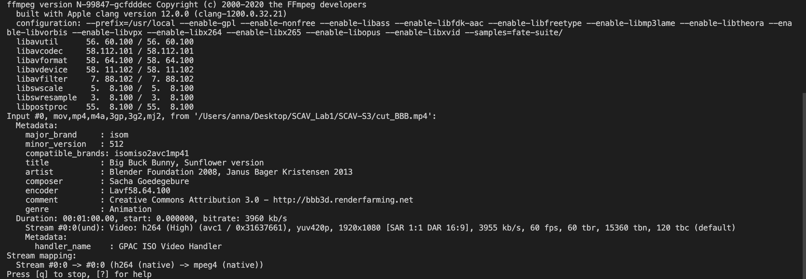
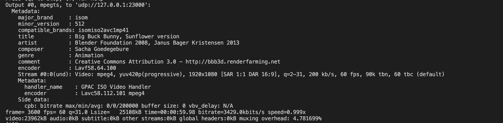

# SCAV-S3
We assume that in the current folder there are the following files:

- BBB.mp4
- BBB_160x120.mp4
- BBB_360x240.mp4
- BBB_480p.mp4
- BBB_720.mp4

Remark that in the S3.py script we have created a class able to storage:

1. Current directory path
2. Input path: useful to transcode a given video to other codecs.
3. Files: a list of the files in the current directory path.
4. Output folder: used to save the new videos systematically.

Notice that we have implemented this class due to the user is able to decide which video want to use, in the case the user want to use other videos is able to do it.
## Exercice 1
In this exercice we had to convert the previous videos into VP8, VP9, h265 & AV1. To do that, we have created a new script called transcode.py, for each video selected by the user in the menu it will convert it to the previous specified formats.

We start converting the input video to avi.First we define the output name by taking into account the desired output directory. In other words, for each video a folder created with its name will be created inside the Results folder. In the case we were using the BBB_160x120.mp4 video, the folder will have a directory similar to /Results/BBB_160x120. This directories are previously created. 
```
AVI_output = output / '{}_avi.avi'.format(name)
command = f"ffmpeg -i {input} -c:v copy -c:a copy {AVI_output}"
os.system(command)
displayVideo(AVI_output)
```
AVI is a container format thus can handle different codecs. For this reason we keep the original of the file. It should be pointed out that i had tried to specify the videocodec as but it does not work as expected.Finally the displayVideo() function is called. This function allows the user to decide if wants to see the generated video. I am using mac, and the pc does not allow me to see the transformed videos so i had to use the ffplay command to visualize it, then i had created this function to be able to do it. The following transformation will be to VP9 containers:
````
VP9_output = output / '{}_vp9.webm'.format(name)
command = f'ffmpeg -i {input} -c:v libvpx-vp9  {VP9_output}'
````
As we had learnt, VP9 has an specific audiovisual media file format, and its predefined audio codec is opus codec. I has tried to ues the .webm format and the libopus audiocodec but it does not work. We define the output filename as in the avi case and after running the command the user is able to display it. 

The same happens with VP8, we define its output filename and we use the following command:
````
VP8_output = output / '{}_vp8.mkv'.format(name)
command =  f"ffmpeg -i {input} -c:v libvpx -qmin 0 -qmax 50 -crf 5 -b:v 1M -c:a libvorbis {VP8_output}"
````    
VP8, the VP9 predecessor, also has an specidic audio and video codec and its own kind of files .mkv. With the -b:v flag ffmpeg will simply try to reach the specified bit rate on average,i.e, 1 MBit/s. In order to ensure that every frame gets the number of bits it deserves to achieve a certain quality level the crf parameter is used, notice that the -b:v becomes the maximum allowed bitrate. Finally we had used two more parameters -qmin and -qmax twhich are quantization parameters, lower values they have generally means "better quality". In this way the encoder is "free" to assign the quality in an specified range.

The last container format is H265:
````
H265_output = output / '{}_h265.mp4'.format(name)
command = f'ffmpeg -i {input} -c:v libx265 -crf 26 -preset fast -c:a aac -b:a 128k {H265_output}'
````
We define the crf parameter to 26 in order to achieve a enough good quality. The preset parameter determines compression efficiency and therefore affects encoding speed. In this case we are not copying the audio codec, we are specifing the aac codec with 128k bitrate.

## Exercice 2
In this exercice our goal is create a new video as the one of the 4 videos at the same time. 

As we had mentioned above, for each video we create a given folder to save its new formats. In this exercice the user is able to choose which folder (with its respective four videos) wants to use. The obtained multiple video looks as:
<p align="center">
  
</p>
<p align="center">
  
</p>
Regarding the bitrate, the order is [0][0]AVI [0][1]VP9 [1][0]VP8 [1][1]H265, 

## Exercice 3
In this exercice our goal is stream a video. In order to do that we have created the stream.py script that get the cut_BBB video(one minute fragment of BBB video), to stream it we need to broadcast the video into a IP adress, the used command is the following:
````
command = f'ffmpeg -re -i {input}  -vcodec mpeg4 -f mpegts udp://127.0.0.1:23000'
````
We are broadcasting to the 127.0.0.1 IP adress, using the 23000 port and the UDP protocol to transmit the video. Althought it does not work at all because it haven't displayed the video through the VLC player we have obtained:

<p align="center">
  
</p>

<p align="center">
  
</p>

Notice that if when we use the stream option, we open a new terminal and we run:

`
ffplay udp://127.0.0.1:23000
`

We are able to see the streaming of the video:

<p align="center">
  
</p>


